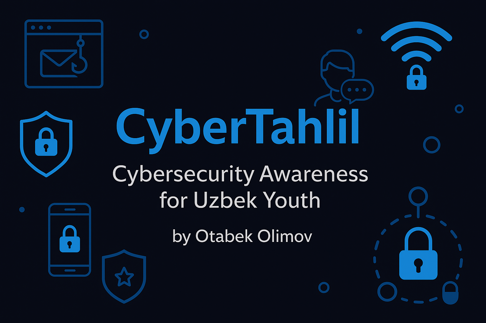

# CyberTahlil: Raising Cybersecurity Awareness in Uzbekistan

**CyberTahlil** is a youth-led cybersecurity awareness initiative launched in 2025 by Otabek Olimov, a high school student from Uzbekistan. The project aims to educate Uzbek students about digital safety, online privacy, and responsible internet use through practical articles in both Uzbek and English.

---

## 📚 Articles Published

Each article is based on real-world digital threats and simplified for easy understanding. So far, we have published the following cybersecurity awareness articles:

1. **Phishing Attacks** – How to identify and avoid fake emails and messages.
2. **Password Safety** – Why strong, unique passwords matter more than ever.
3. **Cyberbullying** – What it is, how it spreads, and how to defend against it.
4. **Social Media Risks** – Managing your privacy and personal information online.
5. **Mobile Security** – Keeping your phone and apps safe from data leaks.

Articles are available in the `articles/` folder in Markdown format.

---

## 🌐 Project Goals

- Make cybersecurity education accessible to Uzbek youth.
- Promote responsible online behavior.
- Encourage more students to engage in tech and cybersecurity fields.

---

## 🧠 Why CyberTahlil?

In Uzbekistan, digital literacy is growing—but so are online threats. Through clear and student-friendly writing, CyberTahlil helps bridge the gap between technology and safe usage.

---

## 👨‍💻 Author

**Otabek Olimov**  
Founder of CyberTahlil  
Gold medal graduate | Cybersecurity applicant  

---

## 🤝 Want to Collaborate?

If you're interested in contributing to CyberTahlil, translating articles, or running awareness campaigns in schools, feel free to reach out or submit a pull request.

---

© 2025 CyberTahlil | All rights reserved.
